# M01 — modelos provisórios das pontes de Tczew

> **Estado: PROVISÓRIO.** São modelos de bloqueio para ligar M01 à engine: escala, pilares, vãos, torres, portais e peças destrutíveis. **Não são assets finais.** Ainda não foram comparados com fotografias, porque a Skarbnica Tczewska, o Wikimedia e o museu estavam bloqueados nesta sessão (P11/T18).

- **Ficheiros:** `assets/models/provisional/m01/`
- **Gerador:** `tools/assets/m01-bridges/`
- **Dados de entrada:** `missions/m01-tczew/map-layout.json`. O hash do ficheiro usado fica em `bridges.manifest.json → mapLayout.sha256_16`.
- **Validação:** `tests/m01-bridges-glb.test.js`, que corre com `npm test`.

Não foram alterados `src/`, `mission.json` nem os horários.

## Ficheiros e polígonos

| Ficheiro | LOD | Triângulos em cena | Triângulos únicos | Vértices | Tamanho | Nós |
| --- | --- | ---: | ---: | ---: | ---: | ---: |
| `bridge_rail_1891_1912.glb` | 0 | 32 672 | 23 612 | 45 656 | 1610 KB | 29 |
| `bridge_rail_1891_1912.lod1.glb` | 1 | 12 240 | 12 240 | 23 720 | 848 KB | 21 |
| `bridge_rail_1891_1912.colliders.glb` | colisores | 432 | 432 | 864 | 58 KB | 36 |
| `bridge_road_lentze_1857_1912.glb` | 0 | 62 152 | 44 584 | 84 564 | 2956 KB | 29 |
| `bridge_road_lentze_1857_1912.lod1.glb` | 1 | 8 108 | 8 108 | 14 020 | 519 KB | 21 |
| `bridge_road_lentze_1857_1912.colliders.glb` | colisores | 432 | 432 | 864 | 59 KB | 36 |
| `portal_lisewo_1912.glb` | 0 | 2 020 | 2 020 | 3 036 | 114 KB | 5 |
| `portal_lisewo_1912.lod1.glb` | 1 | 644 | 644 | 804 | 35 KB | 5 |
| `portal_lisewo_1912.colliders.glb` | colisores | 12 | 12 | 24 | 2 KB | 1 |

**Como ler a contagem:**
- *Triângulos em cena* soma todos os nós, incluindo os estados destruídos, que começam ocultos.
- *Triângulos únicos* conta cada malha uma vez, porque os vãos caídos reutilizam a malha do vão intacto.
- No LOD0, cada vão intacto da rodoviária tem entre 780 e 5 964 triângulos, e cada vão lenticular da ferroviária tem 2 724. Os dois ficam muito abaixo do orçamento de `assets-m01.json`: 30 000 e 25 000 por vão, respetivamente.
- No LOD1 (acima de ~400 m), a treliça densa da Lentze passa a ser uma chapa. A fonte T04 descreve-a como uma treliça que "imitava viga de alma cheia".

O manifesto `bridges.manifest.json` traz os mesmos números por ficheiro e por nó, além dos materiais, das peças destrutíveis e das partes incertas. O teste confirma que o manifesto bate com os GLB.

## Convenções e colocação

- **Unidades e eixos:** metros; +Y para cima; frente em −Z (three.js).
- **Eixo X:** leste, ao longo das pontes. Corresponde ao `x` do mapa.
- **Origem de cada ponte:** `x = 0` do mapa; `y = 0` no trilho ou pavimento do portal oeste; `z = 0` no eixo da ponte.
- **Colocação:** a translação está em `extras.m01.placement.translation` do nó raiz.

| Modelo | `placement.translation` | Origem |
| --- | --- | --- |
| Ferroviária | `[0, 0, 0]` | `rail_bridge.polyline[0]` |
| Rodoviária | `[0, 0, 40]` | `road_bridge.polyline[0]` |
| Portal de Lisewo | `[1049.2, 0, 20]` | último `supportsX` da ferroviária, entre os dois eixos |

**Pilares:** cada `pier_XX` está exatamente no `supportsX[i]` de `map-layout.json`, e o teste verifica-o. O 6.º apoio chama-se `pier_06_old_east_abutment`: é o antigo encontro leste, que depois de 1912 ficou no meio da ponte.

**Pilar a 727,6 m:** existe hoje na ponte ferroviária, mas é pós-guerra (`postwarSupportsX`) e **não foi modelado**.

**Torres:** só nos pilares 1–5 da rodoviária, como em `road_bridge_towers`. Altura 23 m, Ø 5,3 m.

**Treliças da Lentze:** altura 8,68 m, com 6,43 m entre si.

**Portais oeste:** altura total, com ameias, igual ao `heightM` do `map-layout`: 16 m na ferroviária e 18 m na rodoviária.

## Estrutura dos GLB

```
bridge_rail_1891_1912            (extras.m01: placement, supportsX, spansM, status, license)
├── intact
│   ├── abutment_west, portal_west
│   ├── pier_01 … pier_05, pier_06_old_east_abutment, pier_07, pier_08
│   ├── portal_old_east, abutment_east_1912
│   └── span_01 … span_09
└── state_destroyed              (extras: state=destroyed, initiallyHidden=true)
    ├── abutment_west_damaged, pier_01_rubble, span_01_collapsed, span_02_collapsed
    └── pier_06_old_east_abutment_rubble, portal_old_east_rubble, span_06_collapsed, span_07_collapsed
```

Cada nó tem `extras.m01` com os seguintes campos:
- `kind`, `index` ou `supportIndex`, `era`, `lengthM` e `documentedSpanM`;
- `positionCertainty` e `appearanceCertainty`;
- `existenceIn1939` e `damageCertainty`, quando se aplicam;
- `notes`;
- nas peças destrutíveis, `destroyedBy` e `replacedBy`.

Os nós de estado destruído têm `replaces` e `meshFrom`.

## Peças destrutíveis

São as mesmas nas duas pontes. Nenhuma outra peça tem `destroyedBy`, e o teste verifica-o.

| Evento | Hora | Peça intacta → estado destruído |
| --- | --- | --- |
| `evt_m01_east_demolition` | 06:10 | `pier_06_old_east_abutment` → `…_rubble` · `portal_old_east` → `…_rubble` · `span_06` → `span_06_collapsed` · `span_07` → `span_07_collapsed` |
| `evt_m01_west_demolition` | 06:40 | `abutment_west` → `abutment_west_damaged` · `pier_01` → `pier_01_rubble` · `span_01` → `span_01_collapsed` · `span_02` → `span_02_collapsed` |

**Como a engine deve usar isto:** quando o evento ocorrer, ocultar a peça intacta e mostrar os nós listados em `replacedBy`.

- Os vãos caídos reutilizam a malha intacta, inclinada e afundada no rio.
- As poses de queda são `GAMEPLAY_PLACEHOLDER`: não há fotografia da destruição neste repositório (P11/P13).
- Na rodoviária, as torres do pilar 1 fazem parte do nó `pier_01` e desaparecem com ele. Se as fotografias mostrarem que ficaram de pé, separá-las.

**Colisores** (`*.colliders.glb`): caixas simples, a ocultar na renderização.
- `COL_deck_*` → `walkable`;
- `COL_truss_N/S_*` → `partialCover`, `bulletPenetrable`, `coverType: TRUSS_PARTIAL`;
- `COL_abutment_west` → `walkable` (topo do encontro);
- `COL_pier_XX` → `solid`.

Os colisores dos vãos, pilares e encontros que a demolição remove têm o mesmo `destroyedBy` da peça.

## Partes cuja aparência em 1939 é incerta

Estas partes estão marcadas `UNCERTAIN` nos extras e listadas em `uncertainAppearance` no manifesto.

| Parte | Porquê | Como resolver |
| --- | --- | --- |
| `portal_west` (as duas pontes) | Existência documentada (T04/T05); forma, aberturas e alturas supostas; dano às 06:40 não documentado | Fotografias (P11, T18) |
| `portal_old_east` | `existenceIn1939: UNCERTAIN`. T04 cita a destruição do "antigo portal do lado de Lisewo" às 06:10, mas não se sabe se era este portal, de 1857/1891 | P11/P13 |
| `span_07` … `span_09`, `pier_07`, `pier_08`, `abutment_east_1912` | Extensão de 1910–1912: o tipo de treliça e a forma dos pilares não estão documentados (T25). Usado um Pratt genérico | Fotografias de 1912–1939 |
| `span_01` … `span_06` (ferroviária) | O tipo lenticular está documentado (T05). As flechas de 11 m e 5 m, os 9,6 m entre treliças e os painéis de ~8 m são **suposições** | Planos ou fotografias |
| `span_06`, `span_07` (rodoviária): `lengthConflict` | Os pilares medidos hoje (G01) dão 145,4 m e 71,5 m entre eixos; os vãos documentados são 130,9 m e 81,6 m (desvio de +11 % e −12 %). O modelo respeita `supportsX`. Pode refletir vãos trocados depois de 1945 (T04: vãos transferidos em 1958) | P4/P13 |
| Materiais | Cor da pintura do aço, tom do tijolo, tipo de pedra e pavimento: todos INCERTOS (ver `materials` no manifesto) | Fotografias a cores ou descrições |
| `portal_lisewo_1912` e portões | Existência e portões fechados documentados (T07, T25); forma suposta | Fotografias |
| Fundações e talha-mares | Forma suposta (talha-mar a montante, semicírculo a jusante) | Planos |

Também são reconstruídos, mas sem conflito com as cotas: os vãos 1–5 da Lentze (treliça múltipla a 45°, montantes a cada 6,5 m) e os encontros oeste. A face fluvial dos encontros oeste é `supportsX[1] − vão documentado`, e cada encontro tem 32 m de comprimento (T04).

## Imagens de comparação

Renderizadas com o `GLTFLoader` do three.js 0.186.1 (o mesmo da engine) em Chromium headless.

**Sem fotografias, a comparação é feita com:**
- as cotas documentadas: T04 (8,68 m, 6,43 m, 23 m, Ø 5,3 m), T05 (129 m) e T25 (81,6 m);
- os pilares medidos (G01, `measurements.json`).

As fotografias de época ficam pendentes (P11/T18).

| Vista | O que mostra |
| --- | --- |
| 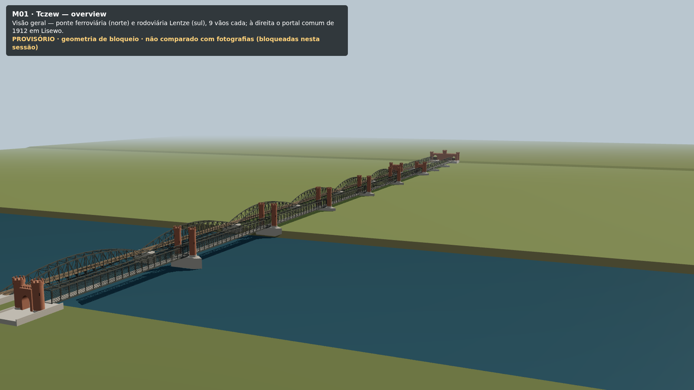 | Visão geral das duas pontes e do portal de Lisewo |
| 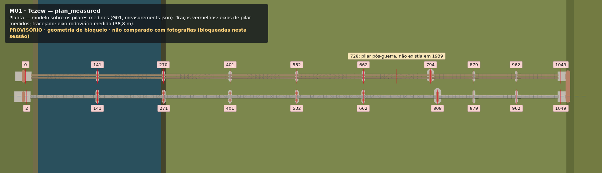 | **Planta sobre os pilares medidos (G01):** traços vermelhos nos eixos medidos; o pilar de 728 m marcado como pós-guerra; tracejado no eixo rodoviário medido (38,8 m; o modelo usa 40 m do `map-layout`) |
| 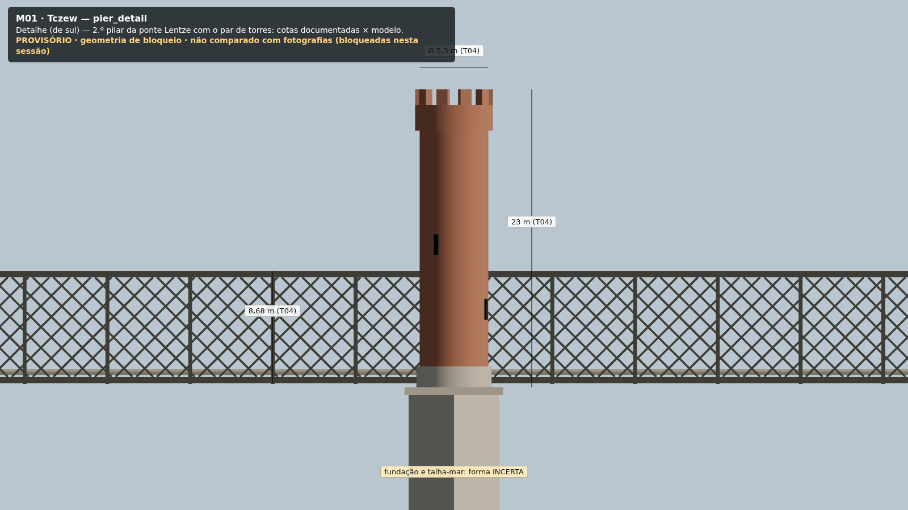 | **2.º pilar da Lentze:** cotas de T04 (8,68 m, 23 m, Ø 5,3 m) sobrepostas ao modelo |
| 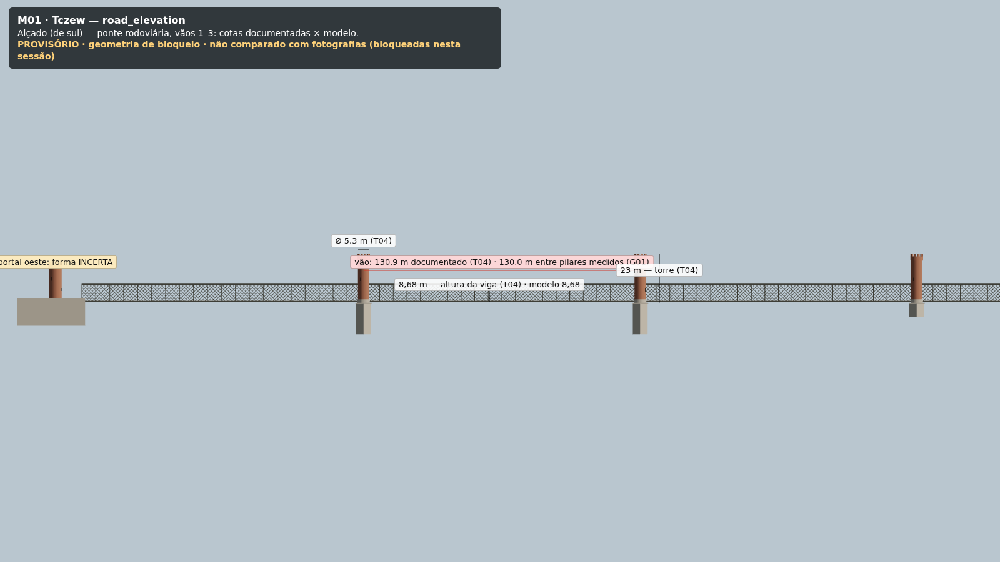 | Alçado da Lentze, com o vão documentado e a distância entre pilares medidos |
| 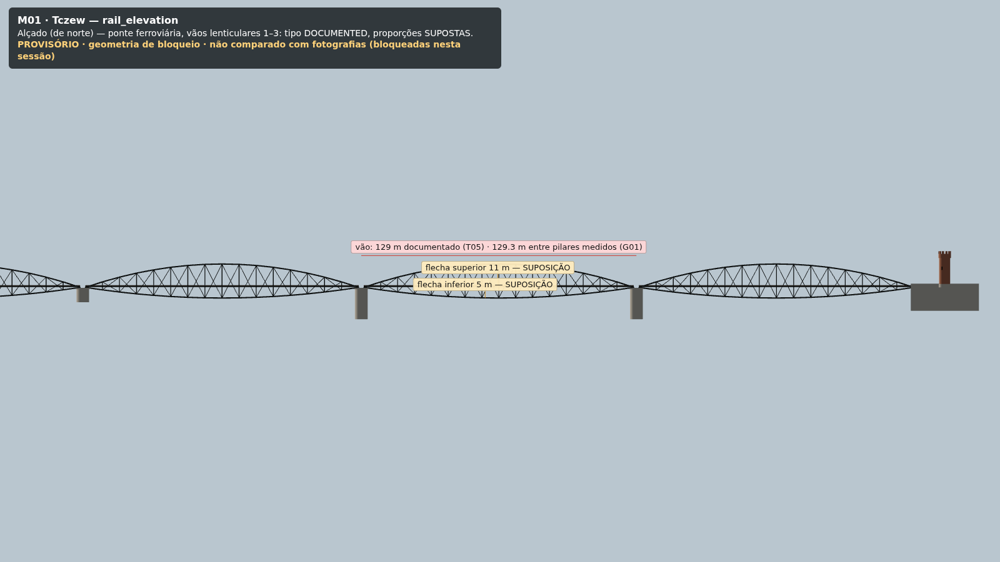 | Alçado da ferroviária: vão de 129 m (T05) contra 129,3 m entre os pilares medidos; flechas marcadas como suposição |
| 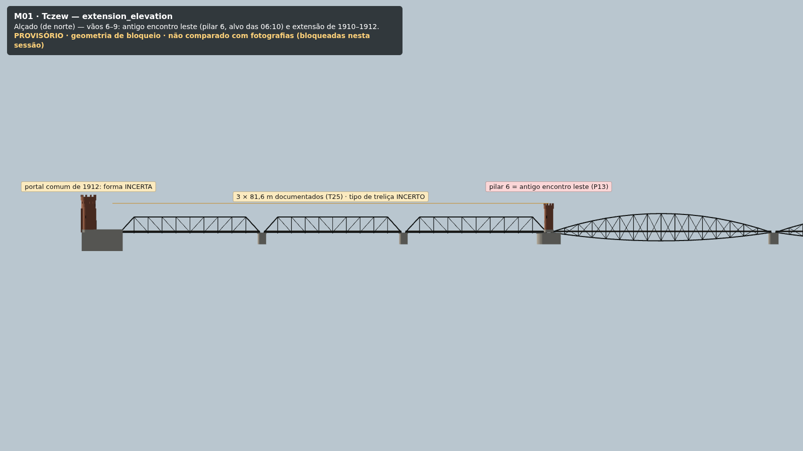 | Extensão de 1910–1912 (3 × 81,6 m), pilar 6 e portal comum |
| 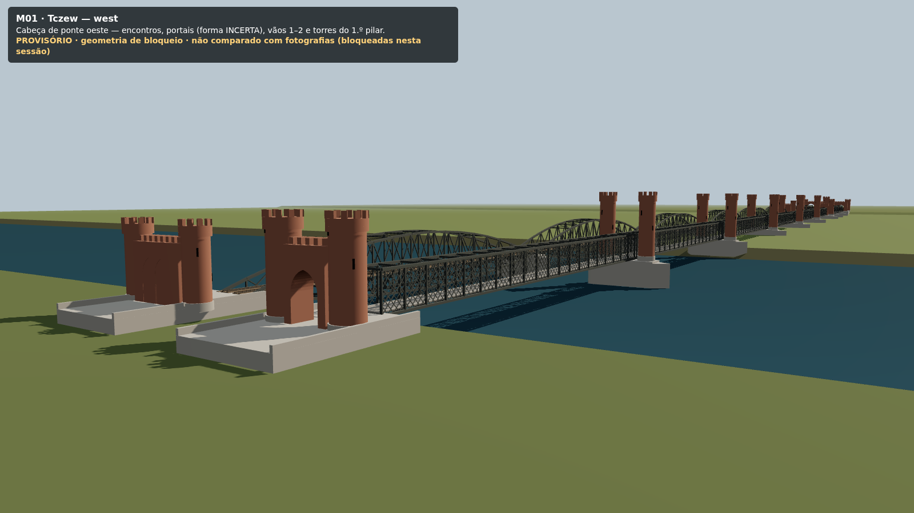 | Cabeça de ponte oeste: encontros, portais e torres do 1.º pilar |
| 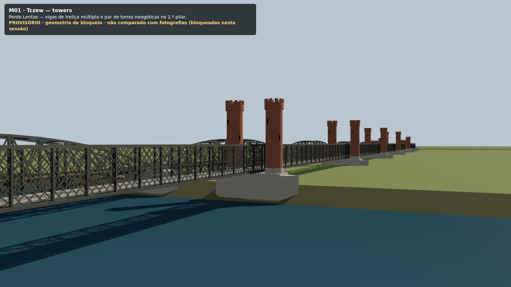 | Treliça múltipla e par de torres |
| 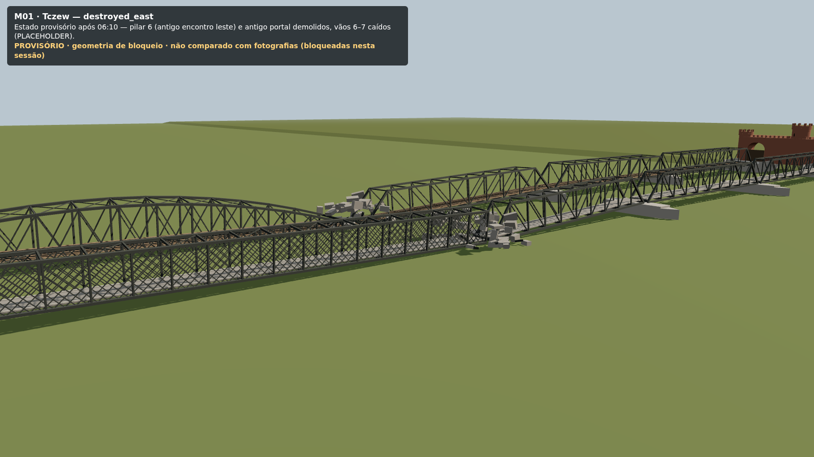 | Estado depois das 06:10 |
| 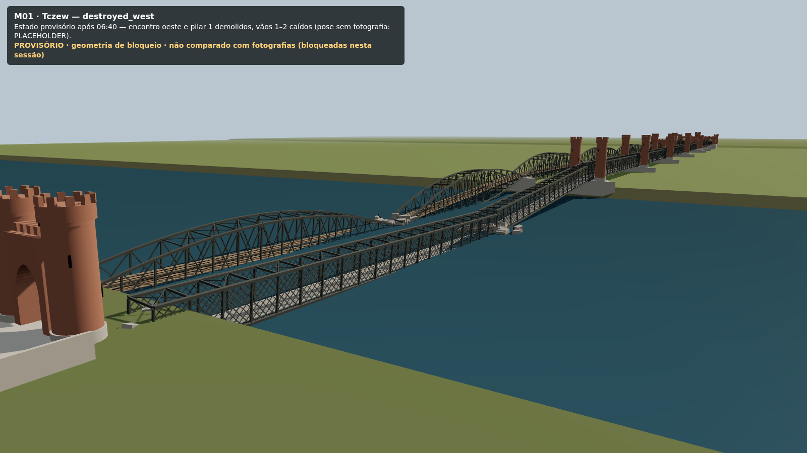 | Estado depois das 06:40 |
| 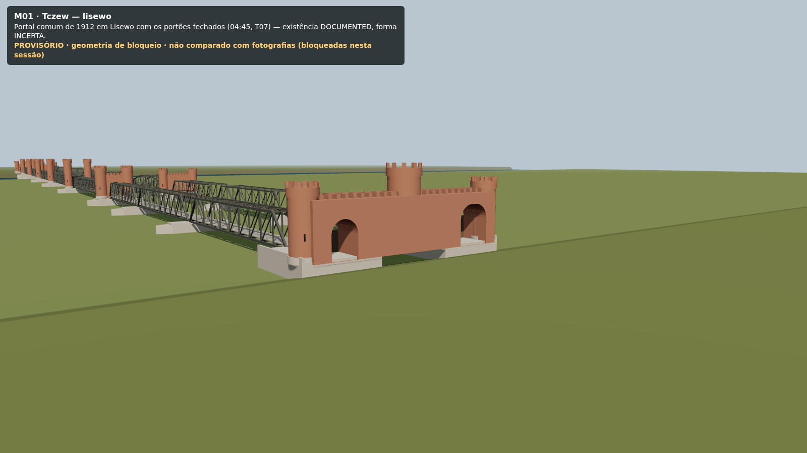 | Portal comum de 1912 com os portões fechados |
| 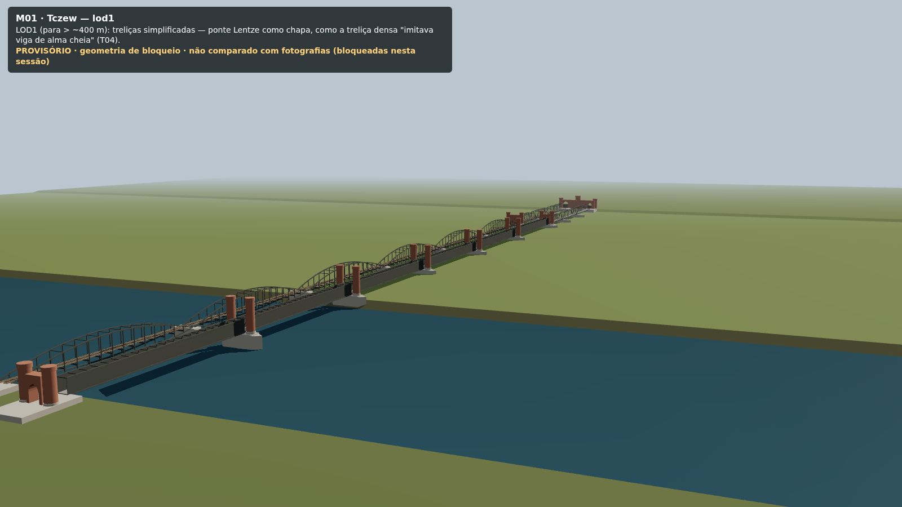 | LOD1 |

## Licença e origem

- **Modelos:** originais do projeto COD-guerra. Gerados por código neste repositório, **sem malhas, texturas ou fotografias de terceiros**.
  - Licença: a do repositório, **que o proprietário ainda não escolheu**.
  - Quando a branch da engine (que tem `ASSET_CREDITS.md`) for integrada, acrescentar uma entrada "Pontes de Tczew (provisório) — original, gerado por `tools/assets/m01-bridges`".
- **Ferramentas do gerador:** dependências de desenvolvimento, não incluídas nos GLB.
  - `three` 0.186.1 (MIT);
  - `@gltf-transform/core` 4.5.1 (MIT);
  - `property-graph` 4.1.0 (MIT).
- **Ficheiros de origem:**
  - `tools/assets/m01-bridges/src/geom.mjs`: primitivas e extrusões;
  - `src/bridges.mjs`: pontes, pilares, torres, portais e estados destruídos;
  - `src/write-glb.mjs`: escrita glTF e materiais;
  - `build.mjs`: lê `map-layout.json` e escreve os GLB e o manifesto;
  - `render/`: visualizador e vistas.
- **Materiais:** cores PBR lisas, sem texturas. Os materiais CC0 de `ASSETS.md` ficam para a versão final.

## Como regenerar

```bash
cd tools/assets/m01-bridges
npm ci
npm run build                          # GLB + bridges.manifest.json
npm run render                         # PNG em docs/assets/m01-bridges/
npm run render -- pier_detail west     # só algumas vistas
cd ../../.. && npm test                # inclui tests/m01-bridges-glb.test.js
```

O build é determinístico.

O render usa Playwright, procurado nesta ordem:
- no pacote;
- nas devDependencies do repositório;
- em `PLAYWRIGHT_MODULE_BASE=/caminho/para/node_modules/`.

O Chromium corre sempre com SwiftShader (renderização por software), por isso não é preciso GPU.

**Se `map-layout.json` mudar:**
- correr `npm run build` outra vez;
- o hash no manifesto muda;
- o teste falha se um pilar deixar de bater com `supportsX`.

## Notas para a integração

1. **Carregamento:** carregar o GLB do LOD0 e aplicar `placement`. O LOD1 tem os mesmos nomes de nó, exceto os estados destruídos, que só existem no LOD0.
2. **Demolições:** procurar os nós por `extras.m01.destroyedBy`. Os grupos `state_destroyed` começam com `visible = false`.
3. **Colisores:** carregar à parte e não renderizar. Usar `extras.m01.collider` para o tipo de colisão e `extras.m01.of` para saber a que peça pertence.
4. **Desalinhamento com o `map-layout`:** a caixa `casemates_west` vai de x 0 a 26, com as seteiras em x = 25. O encontro oeste modelado da rodoviária vai de x −22 a 10, porque a face fluvial segue `supportsX[1] − 130,9 m`. As seteiras do `map-layout` ficariam por baixo do vão 1, e não dentro do encontro. É preciso decidir qual dos dois prevalece; não alterei o `map-layout`.
5. **Eixo da rodoviária:** o `map-layout` usa z = 40; a medição G01 dá 38,8 m (ver `plan_measured`). O modelo segue o `map-layout`.
6. **Conflitos de comprimento:** `lengthConflict` aparece nos vãos em que a distância medida entre eixos se afasta mais de 8 % do vão documentado. O teste exige a marcação a partir de 10 %.
