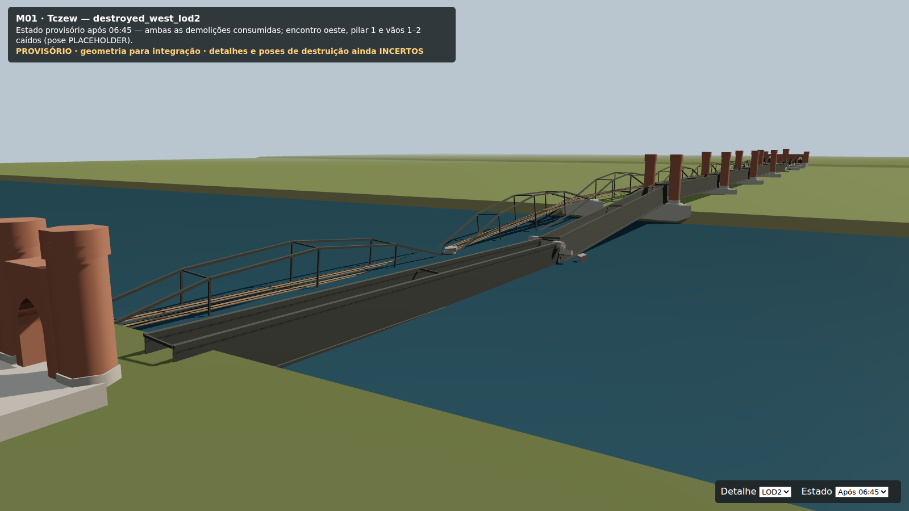

# M01 — pontes provisórias do Claude, completadas para integração

**PROVISÓRIO VERIFICADO.** Os modelos e o gerador da branch `claude/m01-bridge-models` foram conservados e completados com LOD2, estados destruídos nos três LODs, peças com IDs/pivôs estáveis e colocação já aplicada à raiz. M01 continua **PLANEJADA**, sem playtest na engine.

[Relatório completo: dimensões, polígonos, referências, licença e limitações](../../../missions/m01-tczew/BRIDGE_ASSET_REPORT.md) · [Evidência do navegador](review-results.json)

- Modelos: `assets/models/provisional/m01/` — 12 GLB e `bridges.manifest.json`.
- Origem/gerador: `tools/assets/m01-bridges/`, incluindo código de malhas e exportação.
- Entrada: `missions/m01-tczew/map-layout.json`; o manifesto e testes verificam o hash actual.
- Verificação Node: `tests/m01-bridges-glb.test.js`, no `npm test` da raiz.
- Revisão visual: Three.js 0.186.1 / GLTFLoader, Chromium WebGL; 17 PNG.

## Importação e estado

Unidades em metros, +X leste, +Y altura, +Z sul. Importar os GLB com transformação identidade: a rodoviária já está em Z=40 e Lisewo em `[1049.2,0,20]`. `extras.m01.placement.translation` é informação para conferência, não um deslocamento adicional.

As peças mantêm IDs `rail/road_span_01…09`, `rail/road_support_00…09`, `rail/road_portal_west`, `rail/road_portal_old_east` e `road_tower_01_n…05_s`. Prefixos alternativos estão abreviados aqui; os nomes reais e referências estão no manifesto. As torres são separadas dos pilares.

**Extras glTF não ocultam peças automaticamente.** Aplicar o adaptador antes de adicionar cada modelo à cena:

```js
import { applyBridgeState } from './tools/assets/m01-bridges/src/state.mjs';
const gltf = await loader.loadAsync(assetPathForLod);
applyBridgeState(gltf.scene, save.consumedEventIds);
scene.add(gltf.scene);
```

Reaplicar após mudar o LOD e restaurar o save. O adaptador não decide eventos nem horários. Só recebe IDs consumidos, oculta intactos e mostra substitutas. Os grupos de dano permanecem como recipientes; a visibilidade é controlada nos filhos.

Colisores: carregar os GLB separados, aplicar o mesmo estado, não renderizar, e usar apenas nós com `userData.colliderEnabled === true`. `extras.m01.of` referencia a peça; treliças são `TRUSS_PARTIAL`, não paredes sólidas. Ainda não há colisores novos nos escombros nem física de queda.

A demolição oeste conserva o ID da leste já consumido. O relógio em `mission.json` adopta 06:45. Ambos os eventos existem nos três LODs. O save mantém apenas dados/IDs, nunca objectos Three.js.

## Capturas verificadas

| Vista | Captura |
| --- | --- |
| Conjunto, LOD0 | [overview.png](overview.png) |
| Cabeceira oeste e portais | [west.png](west.png) |
| Treliça Lentze e torres | [towers.png](towers.png) · [pier_detail.png](pier_detail.png) |
| Alçados e cotas | [road_elevation.png](road_elevation.png) · [rail_elevation.png](rail_elevation.png) |
| Apoio 06 e extensão | [extension_elevation.png](extension_elevation.png) |
| Planta com apoios medidos | [plan_measured.png](plan_measured.png) |
| Portal comum de Lisewo | [lisewo.png](lisewo.png) |
| Conjunto, LOD1 e LOD2 | [lod1.png](lod1.png) · [lod2.png](lod2.png) |
| Demolição leste, três LODs | [LOD0](destroyed_east.png) · [LOD1](destroyed_east_lod1.png) · [LOD2](destroyed_east_lod2.png) |
| Ambas as demolições, três LODs | [LOD0](destroyed_west.png) · [LOD1](destroyed_west_lod1.png) · [LOD2](destroyed_west_lod2.png) |




O visualizador tem selectores de LOD e estado. A verificação automatizada usa esses controlos para testar nove combinações, retornos ao LOD0 e uma recarga/restauração de JSON, além de medir apoios, alturas, normais e caixas envolventes dos GLB realmente importados. Os resultados completos ficam em `review-results.json`. SwiftShader serve à revisão; não representa desempenho numa GPU real.

## Reprodução

Usar Node 24. O gerador tem dependências isoladas, sem alterar o pacote da engine:

```bash
cd tools/assets/m01-bridges
npm ci
npm run build
npm run render                       # 17 capturas e verificação
npm run verify                       # só verificação e resultados JSON
npm run render -- west pier_detail   # capturas escolhidas e verificação
cd ../../..
npm test
```

O render usa Playwright existente no pacote, na raiz ou numa instalação indicada por `PLAYWRIGHT_MODULE_BASE=/caminho/para/package.json`. Se não houver instalação disponível, instalar Playwright num diretório de ferramentas fora do repositório. `CHROME_EXECUTABLE=/caminho/para/chromium` permite usar um Chromium existente; sem essa variável usa o instalado pelo Playwright. O script usa SwiftShader e inicia/fecha o seu servidor local automaticamente.

Para inspeção manual, servir a raiz do repositório e abrir `/tools/assets/m01-bridges/render/viewer.html?view=overview` depois de `npm ci` no gerador. O visualizador usa apenas as dependências locais e os GLB do repositório.

Ao mudar `map-layout.json`, regenerar GLB e manifesto, repetir os testes e a revisão. O teste rejeita hash antigo, apoios/peças em falta, referências de dano quebradas, escala e alturas incoerentes, normais inválidas e orçamentos excedidos.

## Limitações e créditos

Portais, materiais, fundações, detalhes de 1939 e poses de destruição são reconstruções artísticas provisórias. P13 continua parcial. Os comprimentos modernos dos vãos e os nominais históricos não são substituídos silenciosamente; o relatório regista os conflitos. A aceitação histórica final de escala/footprint permanece pendente.

Malhas e materiais originais do projeto: Claude Code, completados por Codex. Licença das criações originais: a do repositório, ainda não escolhida pelo proprietário. Não há texturas/modelos/fotografias de terceiros incorporados. Medições: © OpenStreetMap contributors, via Overture Maps Foundation (ODbL), e Copernicus DEM, conforme `MEASUREMENTS.md`. Dependências do gerador: Three.js 0.186.1, glTF Transform 4.5.1 e property-graph 4.1.0 (MIT).
