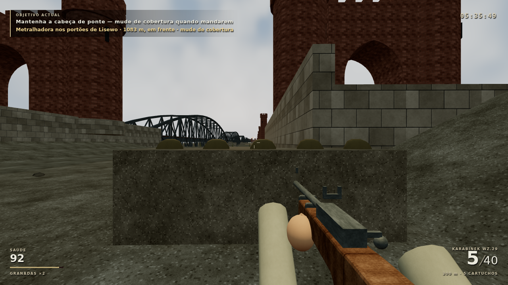
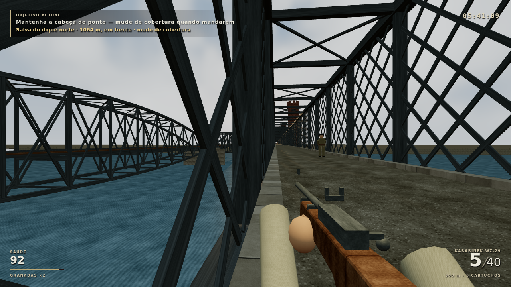

# Origem do ajuste de fogo — verificação por trechos

`toCoverAdjustment()` percorre a simulação com controlos reais até "Mantenha a cabeça de ponte" e espera em cobertura até uma salva. A variante normal fica nos sacos a oeste; `truss: true` atravessa o portal e ocupa a treliça norte. Os snapshots não recebem relógios, eventos ou objectivos injectados.

O navegador continua cada snapshot e orienta o olhar por input relativo para a origem guardada. `report.json` contém erros e diagnóstico; as imagens são capturas originais de produção. Não é uma nova partida contínua ou playtest humano.

O HUD dá a referência mesmo quando a treliça tapa o clarão; não se força a câmara ou a visibilidade do atirador. A ordem só aparece com fogo real. Os testes de estado incluem parede que impede a salva/aviso, direcção frente/trás sem alterar combate, restauração e rejeição atómica de origem inválida. O dado é opcional no schema 2.

Fumo da boca e impactos usam billboards suaves com alpha e profundidade, partilhando material/textura, em pools de 64/96 instâncias. Não mudam colisão, impacto, dano ou som. Node 101/101; dois novos casos de navegador passaram. Comparação de 12 sementes reproduziu os mesmos resultados anteriores de ajuda/ignora, em `visual-sprint/integration-cover-comparison.json`. Sem medição no Chromebook. M01 permanece **PROTÓTIPO JOGÁVEL**.
