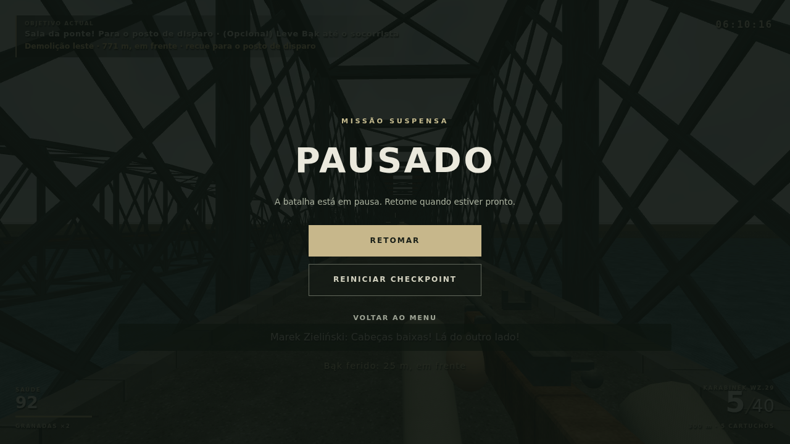

# Orientação na demolição — continuação por trecho

O caso `demolition inside the road truss shows the actual bearing while mouse look remains free` em `tests/browser/m01.spec.js` carrega um snapshot alcançado pela rota de simulação, imediatamente depois das 06:10. O jogador está no tabuleiro rodoviário, x≈30/z≈40. Não é uma partida humana ou uma nova partida contínua no navegador.

O input relativo vira o olhar para trás e depois para o impacto real (x=800/z=20). O teste exige a direcção correspondente no HUD, igualdade com o estado da simulação e posição preservada. A câmara permanece livre. Em seguida liberta pointer lock e captura uma pausa real: o escurecimento e a janela de pausa pertencem ao jogo. A imagem não foi retocada.

Verificação local: Node 97/97, build a passar e caso de navegador 1/1 em 23,8 s, Chromium 153/SwiftShader, 1280×720. Sem erros de página ou respostas de rede >=400 no caso. Não mede FPS ou Chromebook.

Os dois testes de estado também verificam distância calculada do impacto, restauração JSON, expiração por tempo activo, distinção leste/oeste e mesmas consequências ao olhar para frente/trás. A indicação não substitui a encenação: o colapso e a poeira podem continuar tapados pela treliça. Composição, playtest humano e arte final permanecem pendentes.
