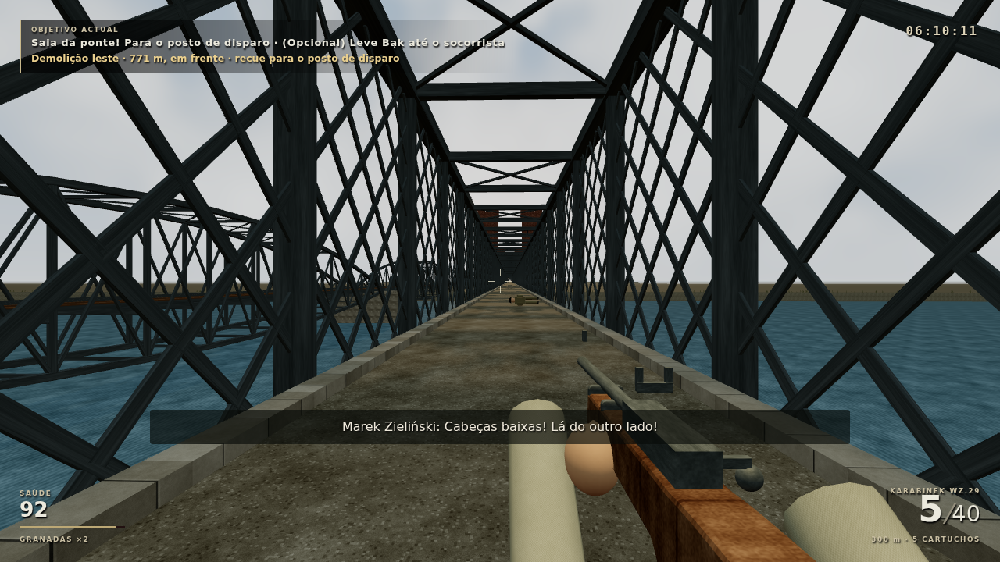
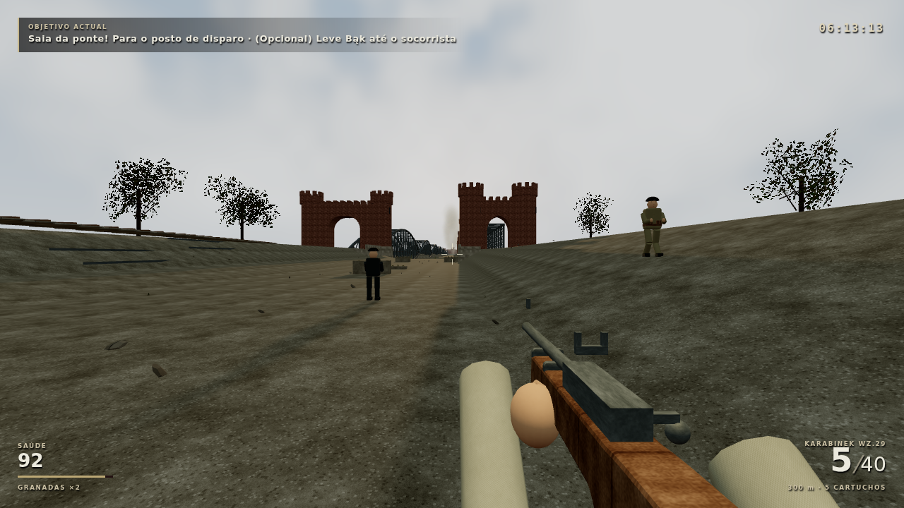

# Poeira das demolições — verificação visual por trechos

Build de produção, Chromium 153/SwiftShader, 1280×720, preset médio. Reproduzir com `tools/capture-m01-visual.mjs <pasta> --demolition-only`, conforme RUNBOOK. O script continua dois snapshots alcançados por controlos e física da rota de simulação. O olhar é orientado por input relativo para o impacto real em x=800/z=20; nenhuma alteração injectada em relógios, eventos, actores ou objectivos.

| Captura | Posição aproximada | Resultado |
| --- | --- | --- |
| Dentro da treliça | x=29, z=40 | A treliça tapa a coluna; o HUD identifica demolição leste, 771 m, em frente, e recuo seguro. |
| Fora da treliça | x=−100, z=29 | A coluna aparece ao fundo entre os portais. O snapshot é posterior, durante o recuo. |

Capturas originais, sem retoque ou janela de pausa. `report.json` guarda os diagnósticos após cada captura: 0 erros de página/consola/rede, 47 puffs activos em cada, 332/343 draw calls e 642.574/648.222 triângulos (incluindo passes de sombra). São cenas em momentos/posições distintos; não constituem comparação antes/depois nem medição de FPS.

A alteração remove o ciclo de reposição abrupta da poeira da demolição. A subida é contínua, com expansão/deriva artística; emissores finitos desvanecem antes de desaparecer e fumo contínuo desvanece antes de repetir. Capacidades, profundidade/obstrução, simulação e saves mantidos. Node 97/97 e build a passar. Não substitui um playtest humano, a encenação completa do colapso ou testes no Chromebook. M01 permanece **PROTÓTIPO JOGÁVEL**.
