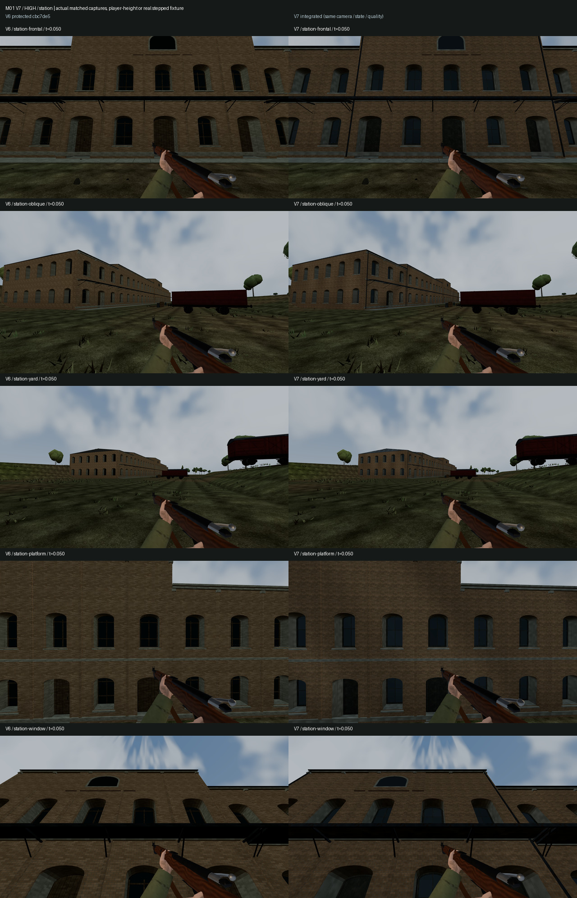
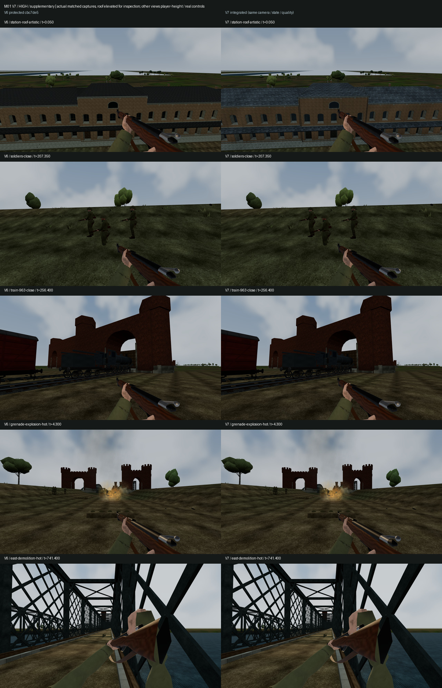
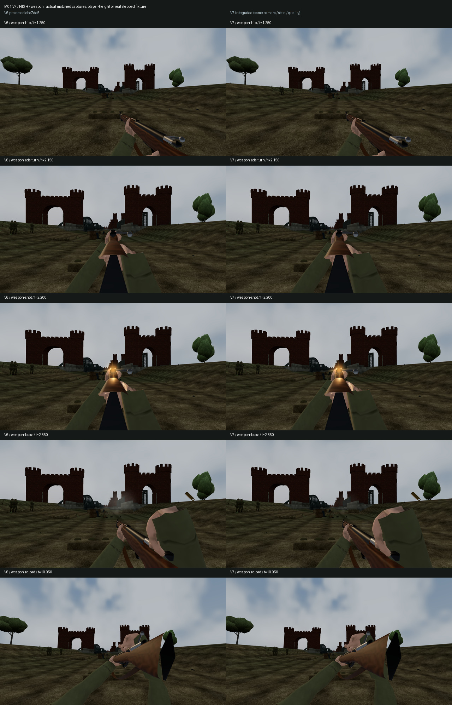

# M01 V7 — comparação visual com a V6 protegida

Capturas reais, sem imagem gerada ou retoque. V6: `cbc7de5668a1b2e4bc646b86548196a5f4f1039a`; V7: o mesmo runtime certificado no commit `8f7d1ea8f096472436c860e118a8c799e740e23f`. As alterações posteriores são de CI, verificação e documentação.

## Método e cobertura

- **57 pares principais / 114 frames**, em Low, Medium e High: Station frontal/oblíqua/yard/plataforma/janela, pontes east/west, 963, Panzerzug, soldados, evacuação, roll-call; arma hip/ADS durante rotação/disparo/brass/recarga; granada e demolição east. Os 36 pares do jogo usam câmaras à altura do jogador; os 21 transitórios usam a fixture existente do renderer e controlos/ticks reais.
- **15 pares suplementares / 30 frames**: roof, soldados próximos, 963 próxima, granada após 0,20 s e demolição east após 0,25 s do evento genuíno. O roof usa uma pose elevada de inspeção, explicitamente não navegável. Não se injetam explosões, eventos, novos timings ou autoridade.
- Em cada par coincidem qualidade, câmara, relógio e SHA-256 do snapshot. A pausa mantém o estado congelado. Os relatórios incluem erros de página/HTTP e contadores efetivamente expostos pelo renderer. A fixture antiga V6 não expõe os contadores transitórios; esses campos não são inventados.
- Os **114 hashes de PNG originais do CI coincidem com os 114 locais**, apesar dos browsers 145/153. Foram inspecionadas as 12 boards locais principais e as três suplementares; as boards principais Station/world/weapon High foram também abertas diretamente no conjunto CI. A igualdade dos PNGs prova que o CI contém as mesmas imagens já revistas.

[VISUAL_SUMMARY.json](VISUAL_SUMMARY.json) contém as medidas dos PNGs originais, **27/57 pares pixel a pixel idênticos** e os contadores por versão/qualidade. A igualdade de pixels não é exigida para as melhorias intencionais. As cópias JPEG permanecem a 1280×720, qualidade 92, sem retoque. Os 114 PNGs principais e os JSONs completos estão no [artifact do run 37835181912](https://github.com/Brawl2007/COD-guerra/actions/runs/37835181912), ID `11577000458`, retenção até 2027-01-06. Os 30 PNGs suplementares foram medidos na execução local; as cópias JPEG, hashes e relatórios estão nesta pasta, e o modo `--supplementary` permite reproduzi-los. Não pertencem ao artifact principal do CI.

## Observações de revisão

| Área | Diferença / evidência | Limite ou problema preservado |
|---|---|---|
| Station frontal, plataforma e janela | Tijolo com escala mais fina e tonalidade menos uniforme; remates e caixilhos mais definidos; vidro azul/acinzentado mantém profundidade, incluindo Low. | O ritmo dos 140 vãos ainda é repetitivo. Fachadas continuam escuras na iluminação herdada de madrugada; não se mudou a luz global. |
| Station oblíqua e yard | Mudança de acabamento visível à média distância; cinco volumes e silhueta conservados. | Ao longe a mudança é discreta. Alguns vagões no declive parecem suspensos em ambas as versões; não é um delta V7. |
| Roof suplementar | A cobertura passa de quase preta/uniforme a cinzento azulado com variação visível, cumeeira e remates legíveis, nas três qualidades. | Probe elevado artístico, não prova de posição acessível ao jogador. A arquitetura continua baseada em Poczt226/Poczt734; cor/desgaste/joinery/rufos são estimativas já identificadas na V3. |
| Bridge east/west, 963, Panzerzug, roll-call | Pares principais idênticos em pixels nas três qualidades. Os probes próximos mostram os soldados e a 963 que estavam pouco enquadrados nas vistas iniciais. | A vista principal de 963 é parcialmente tapada por um portal; a de soldados junto à ponte não mostra tropas próximas. Suplementos corrigem a cobertura da inspeção sem esconder as capturas iniciais. |
| Evacuação | Mesmo estado autoritativo, poses e trajetória; diferença visível concentra-se na Station ao fundo. | Formas de personagens/árvores e sombras continuam estilizadas. Não existe Animation Resolver novo. |
| Armas, disparo e recarga | Mãos, ADS, flash, ferrolho, clip e brass presentes. ADS durante rotação permanece alinhado; smoke mais contido e ciclo de ejecta contínuo. | Melhorias de ciclo/lifecycle precisam dos testes temporais além de um frame. O prewarm admitido cobre a primeira utilização; não se certificam as correções posteriores da branch excluída. |
| Explosões e smoke | Granada suplementar mostra fogo/dust no instante quente real; capturas e testes FX conservam os mesmos eventos e lifetimes. | A demolição east continua distante/oculta na câmara de combate escolhida. Esse frame não certifica sozinho a qualidade de partículas; os testes dedicados verificam as camadas, ciclos e pause/restore. |

Não foi encontrada uma regressão visual causada pelos deltas admitidos nos pares inspecionados. Isto não é uma alegação AAA, um levantamento histórico de 1939, um playtest humano ou uma medição de FPS no Chromebook.

## Custo medido

| Station frontal, aplicação real CI | Low V6 → V7 | Medium V6 → V7 | High V6 → V7 |
|---|---:|---:|---:|
| Draw calls | 48 → 48 | 53 → 53 | 56 → 56 |
| Triângulos | 384 047 → 387 593 | 428 618 → 428 886 | 484 908 → 488 312 |
| Instâncias de ambiente | 15 296 → 15 296 | 17 878 → 17 878 | 22 049 → 22 049 |

O módulo Station mantém **7 calls / 10 mapas / 21 geometrias**, sem novos colliders. Triângulos LOD0/1/2: `30 881/28 707/13 382` → `34 285/28 975/16 928`. Low cresce 26,5% no módulo e cerca de 0,9% na cena frontal. Buffers de todos os LODs: `9 632 040` → `10 584 816` bytes; mapas RGBA sem mipmaps: `655 360` → `1 441 792` bytes. Acréscimo aproximado com mipmaps: **1,91 MiB**, não VRAM física medida. Contadores residentes globais também dependem de carregamento/LOD/warm; não são FPS.

## Imagens para revisão

V6 à esquerda, V7 à direita. As boards têm legendas de estado, qualidade e tempo.

Também disponíveis: [Station Medium](boards/station-medium.jpg), [Station Low](boards/station-low.jpg), [world High](boards/world-high.jpg), [FX High](boards/fx-high.jpg), e todas as outras boards Low/Medium e fontes em `visual/`. O [HANDOFF.md](HANDOFF.md) documenta comandos, exclusões, autoridade e recuperação; [PREVIEW.md](PREVIEW.md) permite jogar a V7.
