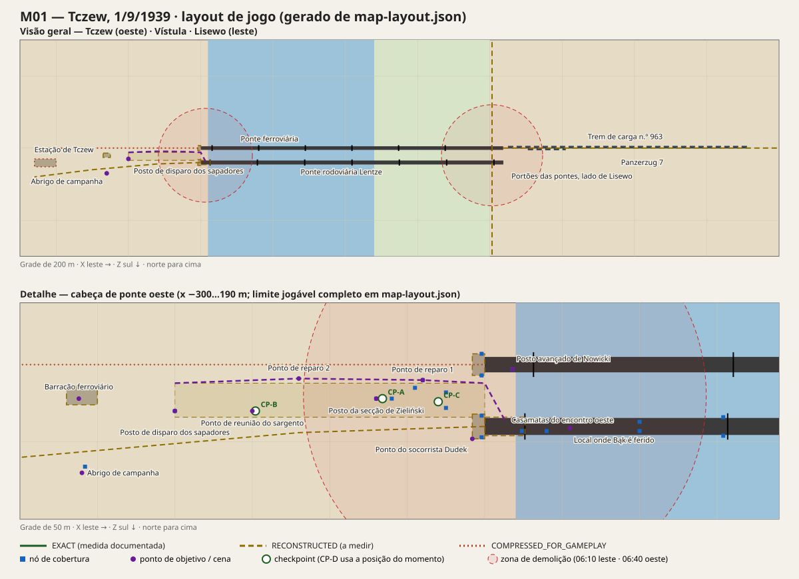

# M01 — Tczew · Mapa e layout de jogo

Dados: [`map-layout.json`](map-layout.json) · Medições: [`MEASUREMENTS.md`](MEASUREMENTS.md) · Pesquisa: [`HISTORICAL_RESEARCH.md`](HISTORICAL_RESEARCH.md) · Roteiro: [`SCRIPT.md`](SCRIPT.md)

O diagrama é gerado a partir dos dados. Para regenerar: `node missions/m01-tczew/tools/render-map-svg.mjs`.

## 1. Sistema de coordenadas

| Item | Valor |
| --- | --- |
| Unidade | metro |
| Eixos | **X+ leste**, **Y+ altura**, **Z+ sul**. Norte é −Z, compatível com Three.js (câmera padrão olha para −Z). |
| Origem | Encontro oeste da ponte ferroviária (pilar mais a oeste medido em G01), no nível dos trilhos (y = 0) |
| Eixo das pontes | X segue a ponte ferroviária. Azimute medido: **89,7°** (ferroviária) e 89,9° (rodoviária). O norte verdadeiro fica a 0,3° de −Z, desprezível. **P5 resolvida.** |
| Protótipo antigo | Usa (x, y) planar em pixels (`CONFIG.tile = 64`). M01 é um mapa novo, sem conversão das coordenadas antigas. Se o adaptador precisar de plano: `planar_x = x`, `planar_y = z`. **O `y` do jogo é só altura**; não reaproveitar o antigo `y` planar como altura (Prompt §70). |

## 2. O que é exato, reconstruído ou comprimido

| Trecho | Classe | Base |
| --- | --- | --- |
| Comprimento das pontes **em 1939: ~1030–1037 m** (837 m em 1857/1891 + extensão de 1910–1912) | `EXACT` | T04, T05, T25 |
| Vãos: 6 × 129 m (ferroviária) e 6 × 130,9 m (rodoviária), mais 3 × 81,6 m em cada | `EXACT` | T04, T05, T25 |
| Posição dos pilares (eixos medidos; o padrão de 1939 coincide com a documentação) | `EXACT` (medição G01, ±5 m) | G01 |
| Ponte rodoviária 40 m ao sul da ferroviária (medido: 38,8 m) | `EXACT` | T05, G01 |
| Vigas da rodoviária: 8,68 m de altura e 6,43 m entre si; torres de 23 m | `EXACT` | T04 |
| Antigo encontro leste e antigo portal (pilar 6, x ≈ 794–808) — alvo das 06:10 | `RECONSTRUCTED` | T04, T07, G01 |
| Portal comum de 1912 e portões em Lisewo (x ≈ 1052); dique junto deles | `RECONSTRUCTED` | T07, T25, G01 |
| Rio corre para o norte; canal atual x 25–265; planície leste até o dique | `EXACT` (orientação) / `RECONSTRUCTED` (canal atual, alturas G02) | T06, G01, G02 |
| Linha de ignição na encosta **sul** do aterro, da ponte até a estação | `EXACT` (lado) / `RECONSTRUCTED` (traçado) | T08, T12, T27 |
| Linhas para Gdańsk (noroeste) e Bydgoszcz (sudoeste); separam-se a ~50 m da ponte | `RECONSTRUCTED` (traçado atual; 1939 pendente) | T24, G01 |
| Estação de 1939 (Stüler), entre as duas linhas, ~330–470 m a oeste | `RECONSTRUCTED` (sítio documentado; contorno pendente) | T24, G01 |
| Abrigo de disparo no terreno da estação (−290, 22) | `RECONSTRUCTED` | T08, T27 |
| Casamatas do encontro oeste: existência documentada, interior reconstruído | `RECONSTRUCTED` | T04 |
| Posto da secção, posto avançado, barracão, abrigo | `RECONSTRUCTED` (dramatização plausível) | — |
| Trem 963 diante dos portões e Panzerzug 7 na via paralela | `RECONSTRUCTED` | T07, T08, T14 |
| Direções distantes: Elbląg a 80°/39,7 km, Malbork a 113°/15,8 km, Westerplatte a 346°/36,1 km | `EXACT` (cálculo por coordenadas de cidades) | — |

Nenhum interior é apresentado como reconstrução exata de edifício histórico (Prompt §74).

## 3. Camadas de distância e setores

| Setor | Camada | Distância do jogador | O que se vê | Independência |
| --- | --- | --- | --- | --- |
| `s1_west_bridgehead` | próxima | 0–150 m | Secção, sapadores, guarnição da metralhadora pesada, feridos, ferroviários | Agenda própria desde as 04:30 |
| `s3_station_yard` | próxima/média | 250–470 m | Estação de 1939 bombardeada, incêndio no pátio, ferido arrastado, posto de socorro, carroças | Acontece com ou sem olhar do jogador |
| `s2_east_bridgehead` | média/longa | 780–1250 m | Portal de 1912 e dique (~1,05 km), trem 963, Panzerzug 7, pelotão leste, clarões de MG, avanço alemão pelos vãos de 1912 até x = 690, explosão no pilar 6 (~800 m) | Relógio de batalha; estado persistido |
| `s4_north_perimeter` | longa | 800–1500 m | Clarões e som de combate a norte; ataque das ~07:00 | Relógio de batalha |
| `s5_sky_east` | longa | 0,8–40 km | Stukas de Elbing, aproximação final pelo sul; fumaça de locomotivas | Relógio de batalha |

Regras (Prompt §71):

- Nenhum setor espera o jogador. Proximidade nunca é a única condição.
- Mortos e destruição persistem entre LODs. O `grp_de_spans` que perde homens às 06:10 não os recupera.
- Tiros do jogador contra S2 atingem as **mesmas entidades** da simulação reduzida, que têm ID e contagem de baixas.

## 4. Rota principal (caminho dourado)

| Passo | De → Para | Distância aprox. | Hora de jogo | Objetivo |
| --- | --- | --- | --- | --- |
| 1 | `squad_post` (−70, 22) → `forward_post` (18, 3) | 90 m | 04:30–04:33 | `obj_m01_deliver_message` |
| 2 | posto → trincheira → `rally_point` (−150, 14), na cunha entre as duas linhas | 170 m | 04:34–04:38 | `obj_m01_take_cover`, `obj_m01_follow_sergeant` |
| 3 | `rally_point` → `repair_site_1` (−40, 10) | 110 m | 04:38–04:42 | `obj_m01_find_sappers` |
| 4 | `repair_site_1` → `rail_hut` (−262, 22) → `repair_site_2` (−120, 9) | 222 + 143 m (carregando) | 04:42–04:55 | `obj_m01_fetch_material` |
| 5 | Posições sobre o aterro, sandbags e portal | ±60 m | 04:55–05:30 | `obj_m01_cover_repair` |
| 6 | Rotação de cobertura: `cv_sandbag_mid_2` → portal → treliças → torre do 1.º pilar (138, 34) | até 140 m | 05:30–06:00 | `obj_m01_hold_access` |
| 7 | Tabuleiro da ponte rodoviária (x 20–160) | — | 06:00–06:10 | `obj_m01_cover_withdrawal`; opcional `obj_m01_rescue_bak`: carregar Bąk 63 m até `aid_position` |
| 8 | Tabuleiro → `firing_point` (−290, 22), no terreno da estação | 310–450 m | 06:10–06:45 | `obj_m01_leave_bridge`, `obj_m01_hold_corridor` |
| 9 | `firing_point` → `shelter` (−260, 70) | 57 m | 06:45–07:05 | `obj_m01_reach_shelter` |

**Alternativas de rota (Prompt §22):**
- Trincheira de ligação ou faixa aberta entre os acessos (atravessada pelo aterro da linha para Bydgoszcz, que também serve de cobertura).
- Crista do aterro (rápida e exposta) ou encosta sul (protegida do norte, visível do leste).
- Tabuleiro da ponte rodoviária ou ferroviária para o flanco de observação.

## 5. Limites e segurança

- **Área com movimento:** x −460…440, z −80…140; inclui a zona de aviso além de x = 401. A rota recomendada fica a oeste de x = 270. Não bloquear o jogador antes de ele alcançar o limite anunciado.
- **x > 270 (2.º pilar):** o fogo da margem leste se intensifica e Zieliński manda voltar.
- **x > 401 (3.º pilar):** aviso na tela e falha legível após 8 s. Nunca parede invisível sem aviso.
- **Zona de demolição leste** (`bz_east`, centro (800, 0, 20) no pilar 6, raio 140 m): a demolição espera todo o pelotão leste com x < 660.
- **Zona de demolição oeste** (`bz_west`, centro (70, −3, 20), cobrindo o encontro oeste e o pilar 1, raio 160 m): a demolição espera o jogador e os atores obrigatórios com x < −90. **A demolição polonesa nunca mata o jogador.** Se ele insistir em ficar, Zieliński vai buscá-lo.
- **Checkpoints:** nunca salvar dentro de `bz_west` depois das 06:36, nem com o jogador carregando Bąk (ver `mission.json`).

## 6. Cobertura

25 nós em `map-layout.json → coverNodes`, cada um com posição, normal (todos voltados a +X, leste), altura e lados de exposição (`peek`). Tipos usados: `WALL_CORNER`, `WINDOW`, `SANDBAG`, `TRENCH`, `LOW_COVER`, `HIGH_COVER`, `BUILDING_CORNER` e `VEHICLE`.

- **Treliças da ponte** (`partial: true`): cobertura parcial. A engine deve usar a geometria real das barras e deixar passar tiros pelas aberturas. Nada de "cobre 50%" por sorteio.
- **Nós dinâmicos:**
  - `cv_forward_post` pode ser destruído às 04:34.
  - `cv_crater_1` surge após o bombardeio.
  - As seteiras das casamatas desaparecem às 06:45.
- **Reserva:** `cv_casemate_emb_s` fica reservado à guarnição da ckm wz.30.

## 7. Luz (cálculo C01)

| Hora | Sol | Leitura |
| --- | --- | --- |
| 04:30–04:34 | −3,7° a −3,2°, azimute ~70° | Crepúsculo civil. Faixa clara a ENE; margem oeste escura. A aproximação final dos Stukas vem do sul. |
| 04:51 | nascer, ~74° | — |
| 05:30–06:10 | +4,8° a +10,6°, 82° a 90° | Sol baixo **exatamente atrás do inimigo**: contraluz e ofuscamento para quem olha a leste. Sombras das torres e treliças servem de abrigo visual (dlg_m01_036). |
| 06:45–07:05 | ~15° a ~19° | Luz de manhã clara; poeira em suspensão depois da demolição. |

Não esconder gráfico ruim com escuridão (Prompt §26). A abertura precisa ser legível com tone mapping e névoa leve.

## 8. Som posicional e atraso

- A explosão leste é no pilar 6 (x ≈ 800). De onde Jan está no tabuleiro (x 20–160) fica a ~640–780 m: o clarão aparece em t = 0 e o som chega em **t ≈ 1,9–2,3 s** (C02).
- MG34 do dique (1075, 1, 12) e do trem (1160, 3, 2,5), a ~1,05–1,2 km: timbre distante, cauda longa sobre a água e a planície. Os clarões precisam coincidir com a origem do som (~3 s de atraso).
- A ckm wz.30 da casamata (24, −3, 43) soa próxima e abafada pelo interior de pedra.
- O combate do norte (S4) fica a 0,8–1,5 km: som grave, sem estalidos agudos, com atraso de 2–4 s em relação aos clarões.
- Mixagem: avisos de demolição e falas prioritárias passam por cima do combate distante (Prompt §71).

## 9. Orçamento sugerido (a medir)

Números iniciais para medir no Chromebook de referência; não são resultados (Prompt §75).

- **Próximo:** até 14 humanos com rig completo (secção, sapadores, guarnição da ckm e ferroviários), mais o pelotão leste quando passa (até 18, em lotes).
- **Médio (S2):** até 40 soldados alemães simplificados e 2 composições de trem com LOD.
- **Longo:** proxies e clarões, sem IA completa.

## 10. Medições

Feitas em 01/10/2026 com geometria atual: OSM via Overture (G01) e Copernicus DEM (G02). Detalhes em [`MEASUREMENTS.md`](MEASUREMENTS.md).

| Item | Resultado |
| --- | --- |
| Azimute e alinhamento | Resolvidos (P5) |
| Pilares e comprimento | Medidos; batem com a documentação, incluindo a extensão de 1912 |
| Canal do rio | x 25–265 |
| Dique de 1912 | Junto ao fim das pontes |
| Estação de 1939 | Sítio localizado (rua 1 Maja e rotunda) |
| Alturas aproximadas | Água ≈ −10, planície leste ≈ −5, escarpa oeste sobe ~15–20 m em 300–500 m |

Ainda pendente, porque exige mapa de 1939 (P4):
- traçado das vias e dos desvios;
- contorno da estação;
- quartel;
- posições exatas dos postos de disparo (P12).

Ao medir, atualizar `map-layout.json`, regenerar o SVG e reclassificar cada trecho.
